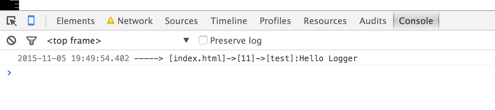

# L.js

A simple extension for browser build in console.log, which can print call stack!!

# How to use
```
<script src="l.js"></script>
L.d('any message');
```

# Demo
[file name]->[line number]->[function name]: Your Message


# Next, Enjoy
